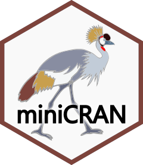

<!-- README.md is generated from README.Rmd. Please edit that file -->

```{r, include = FALSE}
knitr::opts_chunk$set(
  collapse = TRUE,
  comment = "#>",
  fig.path = "man/figures/README-",
  out.width = "100%"
)
```

# miniCRAN 

<!-- badges: start -->
[](https://codecov.io/gh/andrie/miniCRAN?branch=master)
[](http://www.r-pkg.org/pkg/miniCRAN)
[](http://www.r-pkg.org/pkg/miniCRAN)
[](https://cran.r-project.org/package=miniCRAN)
[](https://github.com/andrie/miniCRAN/actions)
[](https://codecov.io/gh/andrie/miniCRAN?branch=master)
<!-- badges: end -->

Create a mini version of CRAN containing only selected packages


## Introduction

At the end of 2014, CRAN consisted of more than 6,000 packages, and by 2017 this number doubled to more than 12,000.  Many organisations need to maintain a private mirror of CRAN, but with only a subset of packages that are relevant to them.

The `miniCRAN` package makes it possible to create an internally consistent repository consisting of selected packages from CRAN-like repositories.  The user specifies a set of desired packages, and `miniCRAN` recursively reads the dependency tree for these packages, then downloads only this subset.  

## Important functions:

Function           | Use it for
--------------     | ------------------------------------------
`pkgDep()`         | Find package dependencies
`makeRepo()`       | Make repository (with or without downloading packages)
`addPackage()`     | Add additional packages (and their dependencies) to existing repository
`updatePackages()` | Update the versions of packages currently in the repository

## Installation:

Get the stable version from CRAN:

```r
install.packages("miniCRAN")
library("miniCRAN")
```

### Development version

Get the latest development version from github:

```r
# Use `devtools` to install directly from github
library(devtools)
install_github("andrie/miniCRAN")
```

## Example:

```r
# Determine and download the packages `ggplot2`, `plyr` and `reshape2`, 
# including their dependencies:

library("miniCRAN")
pkgs <- c("ggplot2", "plyr", "reshape2")
makeRepo(pkgDep(pkgs), path = file.path(tempdir(), "miniCRAN"))
```

## Supported by Microsoft

I started this project while employed by Revolution Analytics and Microsoft.  Microsoft has kindly agreed that I maintain the project individually, and retains copyright to all work on the project until October 2017.

