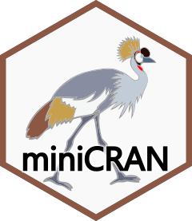

<!-- README.md is generated from README.Rmd. Please edit that file -->

# miniCRAN 

<!-- badges: start -->

[](https://github.com/andrie/miniCRAN/actions/workflows/R-CMD-check.yaml)
[](https://CRAN.R-project.org/package=miniCRAN)
[](https://app.codecov.io/gh/andrie/miniCRAN?branch=main)
[](https://www.r-pkg.org/pkg/miniCRAN)
<!-- badges: end -->

Create a mini version of CRAN containing only selected packages

## Introduction

At the end of 2014, CRAN consisted of more than 6,000 packages, and by
2017 this number doubled to more than 12,000. Many organisations need to
maintain a private mirror of CRAN, but with only a subset of packages
that are relevant to them.

The `miniCRAN` package makes it possible to create an internally
consistent repository consisting of selected packages from CRAN-like
repositories. The user specifies a set of desired packages, and
`miniCRAN` recursively reads the dependency tree for these packages,
then downloads only this subset.

## Important functions:

| Function | Use it for |
|----|----|
| `pkgDep()` | Find package dependencies |
| `makeRepo()` | Make repository (with or without downloading packages) |
| `addPackage()` | Add additional packages (and their dependencies) to existing repository |
| `updatePackages()` | Update the versions of packages currently in the repository |

## Installation:

Get the stable version from CRAN:

``` r
install.packages("miniCRAN")
library("miniCRAN")
```

### Development version

Get the latest development version from github:

``` r
# Use `devtools` to install directly from github
library(devtools)
install_github("andrie/miniCRAN")
```

## Example:

``` r
# Determine and download the packages `ggplot2`, `plyr` and `reshape2`, 
# including their dependencies:

library("miniCRAN")
pkgs <- c("ggplot2", "plyr", "reshape2")
makeRepo(pkgDep(pkgs), path = file.path(tempdir(), "miniCRAN"))
```

## Supported by Microsoft

I started this project while employed by Revolution Analytics and
Microsoft. Microsoft has kindly agreed that I maintain the project
individually, and retains copyright to all work on the project until
October 2017.
