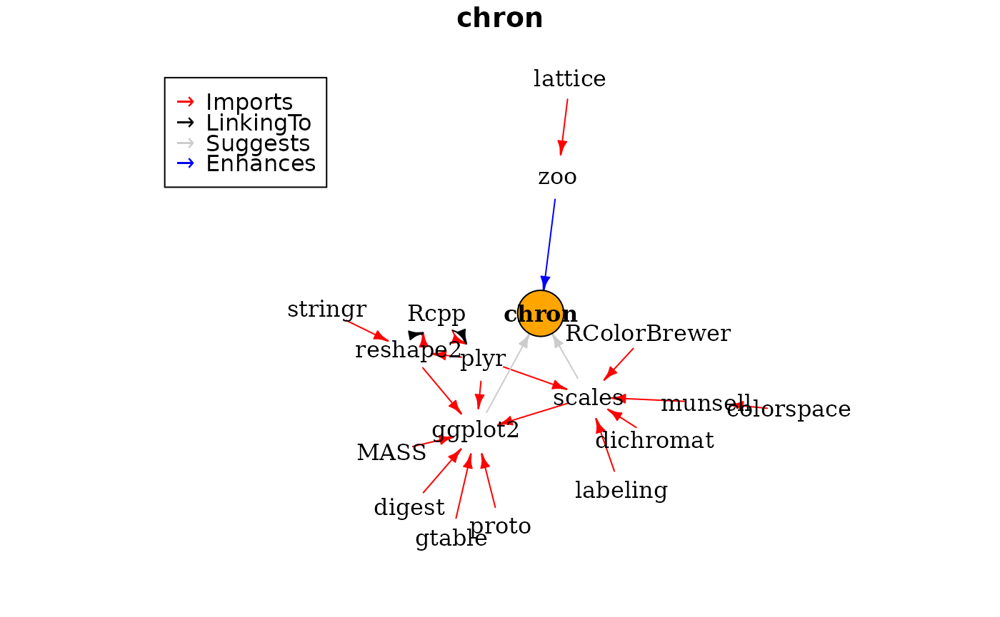
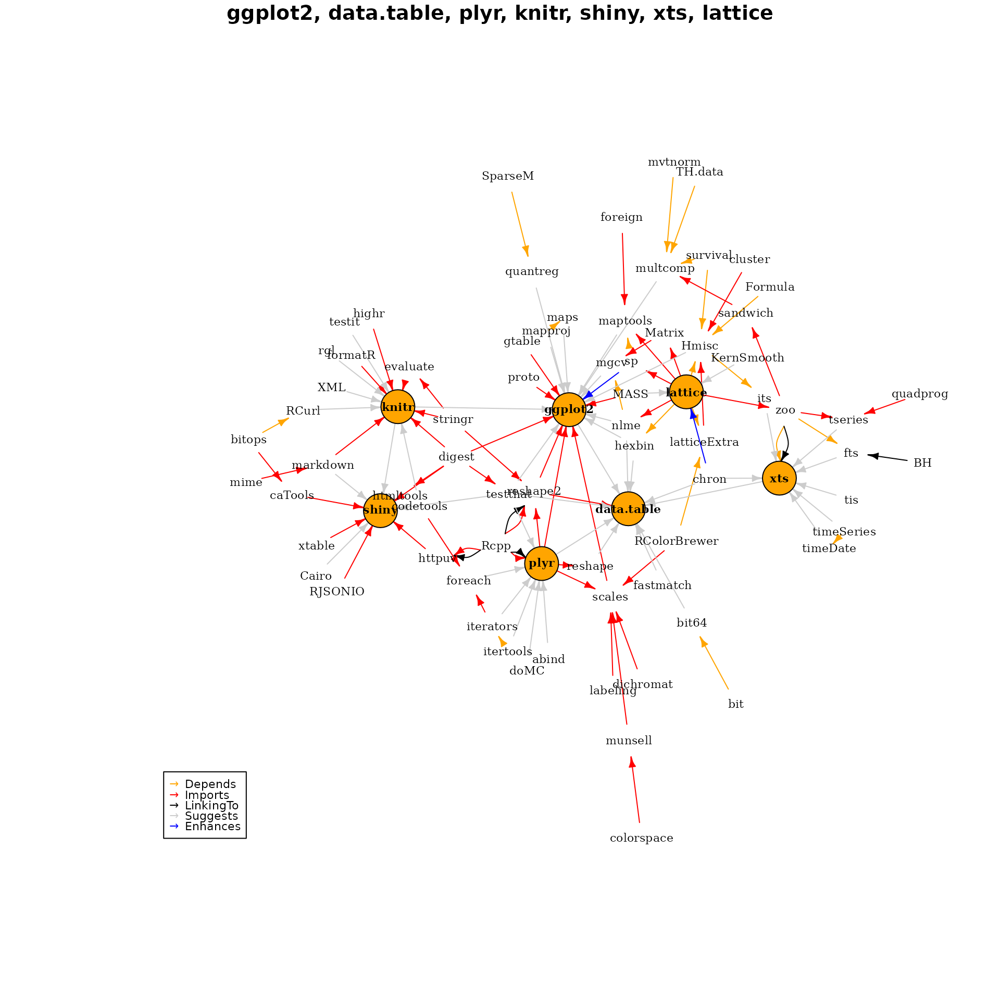

# Using miniCRAN to identify package dependencies

The `miniCRAN` package exposes two functions that provide information
about dependencies:

- The function
  [`pkgDep()`](https://andrie.github.io/miniCRAN/reference/pkgDep.md)
  returns a character vector with the names of dependencies. Internally,
  [`pkgDep()`](https://andrie.github.io/miniCRAN/reference/pkgDep.md) is
  a wrapper around
  [`tools::package_dependencies()`](https://rdrr.io/r/tools/package_dependencies.html),
  a base R function that, well, tells you about package dependencies. My
  [`pkgDep()`](https://andrie.github.io/miniCRAN/reference/pkgDep.md)
  function is in one way a convenience, but more importantly it sets
  different defaults (more about this later).

- The function
  [`makeDepGraph()`](https://andrie.github.io/miniCRAN/reference/makeDepGraph.md)
  creates a graph representation of the dependencies.

The package `chron` neatly illustrates the different roles of Imports,
Suggests and Enhances:

- `chron` **Imports** the base packages graphics and stats. This means
  that `chron` internally makes use of graphics and stats and will
  always load these packages.

- `chron` **Suggests** the packages scales and ggplot2. This means that
  `chron` uses some functions from these packages in examples or in its
  vignettes. However, these functions are not necessary to use `chron`

- `chron` **Enhances** the package `zoo`, meaning that it adds something
  to `zoo` packages. These enhancements are made available to you if you
  have `zoo` installed.

## A worked example using the package chron

The function
[`pkgDep()`](https://andrie.github.io/miniCRAN/reference/pkgDep.md)
exposes not only these dependencies, but also all recursive
dependencies. In other words, it answers the question which packages
need to be installed to satisfy all dependencies of dependencies.

This means that the algorithm is as follows:

- First retrieve a list of `Suggests` and `Enhances`, using a
  non-recursive dependency search
- Next, perform a recursive search for all `Imports`, `Depends` and
  `LinkingTo`

The resulting list of packages should then contain the complete list
necessary to satisfy all dependencies. In code:

``` r
library("miniCRAN")
```

``` r
tags <- "chron"
pkgDep(tags, availPkgs = cranJuly2014)
```

    ##  [1] "chron"        "RColorBrewer" "dichromat"    "munsell"      "plyr"        
    ##  [6] "labeling"     "colorspace"   "Rcpp"         "digest"       "gtable"      
    ## [11] "reshape2"     "scales"       "proto"        "MASS"         "stringr"     
    ## [16] "ggplot2"

To create an igraph plot of the dependencies, use the function
[`makeDepGraph()`](https://andrie.github.io/miniCRAN/reference/makeDepGraph.md)
and plot the results:

``` r
dg <- makeDepGraph(tags, enhances = TRUE, availPkgs = cranJuly2014)
set.seed(1)
plot(dg, legendPosition = c(-1, 1), vertex.size = 20)
```



Note how the dependencies expand to `zoo` (enhanced), `scales` and
`ggplot` (suggested) and then recursively from there to get all the
`Imports` and `LinkingTo` dependencies.

## An example with multiple input packages

As a final example, create a dependency graph of seven very popular R
packages:

``` r
tags <- c("ggplot2", "data.table", "plyr", "knitr", "shiny", "xts", "lattice")
pkgDep(tags, suggests = TRUE, enhances = FALSE, availPkgs = cranJuly2014)
```

    ##  [1] "ggplot2"      "data.table"   "plyr"         "knitr"        "shiny"       
    ##  [6] "xts"          "lattice"      "digest"       "gtable"       "reshape2"    
    ## [11] "scales"       "proto"        "MASS"         "Rcpp"         "stringr"     
    ## [16] "RColorBrewer" "dichromat"    "munsell"      "labeling"     "colorspace"  
    ## [21] "evaluate"     "formatR"      "highr"        "markdown"     "mime"        
    ## [26] "httpuv"       "caTools"      "RJSONIO"      "xtable"       "htmltools"   
    ## [31] "bitops"       "zoo"          "SparseM"      "survival"     "Formula"     
    ## [36] "latticeExtra" "cluster"      "maps"         "sp"           "foreign"     
    ## [41] "mvtnorm"      "TH.data"      "sandwich"     "nlme"         "Matrix"      
    ## [46] "bit"          "codetools"    "iterators"    "timeDate"     "quadprog"    
    ## [51] "Hmisc"        "BH"           "quantreg"     "mapproj"      "hexbin"      
    ## [56] "maptools"     "multcomp"     "testthat"     "mgcv"         "chron"       
    ## [61] "reshape"      "fastmatch"    "bit64"        "abind"        "foreach"     
    ## [66] "doMC"         "itertools"    "testit"       "rgl"          "XML"         
    ## [71] "RCurl"        "Cairo"        "timeSeries"   "tseries"      "its"         
    ## [76] "fts"          "tis"          "KernSmooth"

``` r
dg <- makeDepGraph(tags, enhances = TRUE, availPkgs = cranJuly2014)
set.seed(1)
plot(dg, legendPosition = c(-1, -1), vertex.size = 10, cex = 0.7)
```


